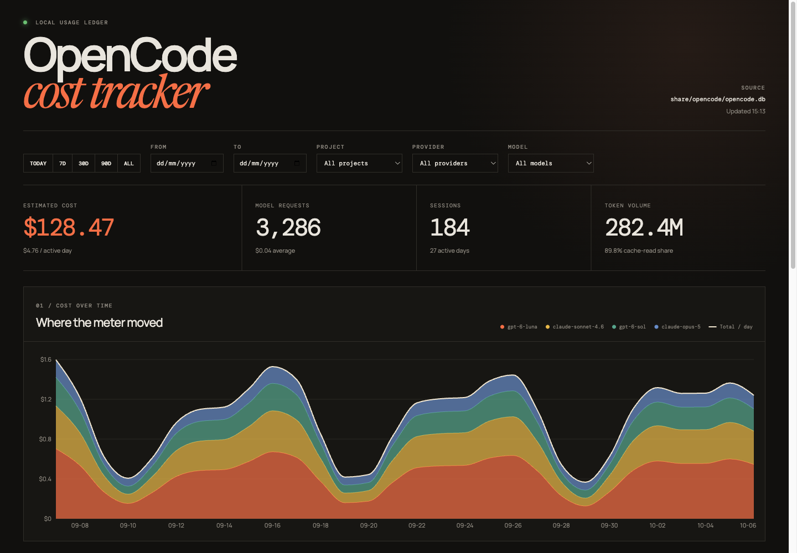
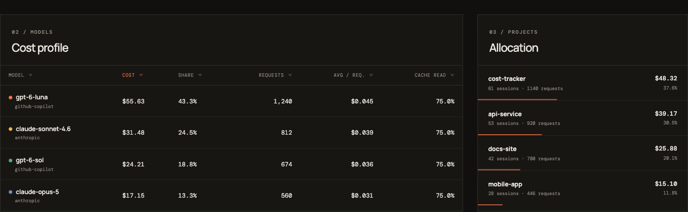
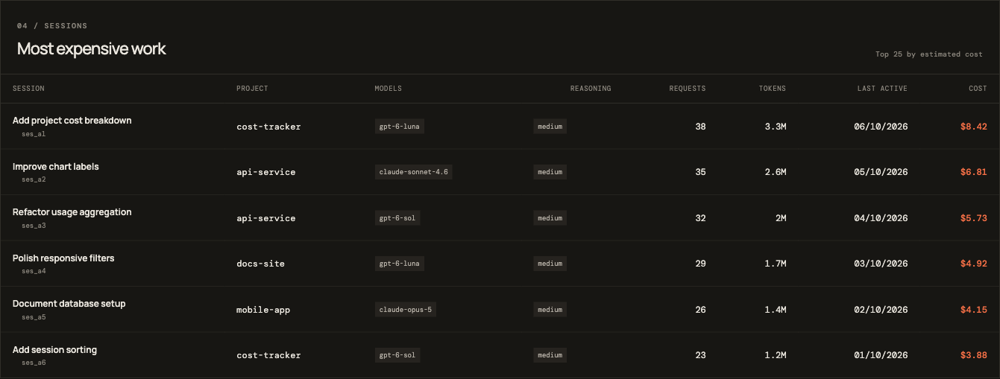

# OpenCode Cost Tracker

A local-first dashboard for understanding the estimated LLM cost recorded by OpenCode.

## Screenshots







## Features

- Estimated cost and token totals
- Daily cost timeline grouped by model
- Model and project cost breakdowns
- Most expensive sessions
- Date, project, provider, and model filters
- Read-only access to the local OpenCode SQLite database

The application does not read or expose prompt and response content. OpenCode's recorded cost can represent API-equivalent pricing for subscription providers, so the dashboard labels it as estimated cost rather than an invoice amount.

## Requirements

- Node.js 24 or newer
- OpenCode with local session history

## Development

```sh
npm install
npm run dev
```

Open `http://localhost:5173`.

## Production

```sh
npm run build
npm start
```

Open `http://localhost:4174`.

## Database Discovery

The server runs `opencode db path` and opens the result in read-only mode. Set `OPENCODE_DB_PATH` to use a different database:

```sh
OPENCODE_DB_PATH=/path/to/opencode.db npm start
```

## Verification

```sh
npm run typecheck
npm test
npm run build
```
